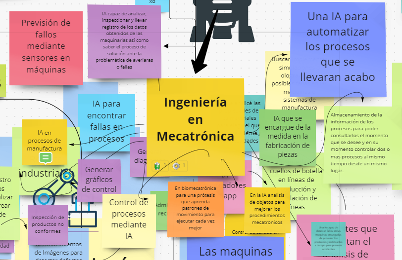

# Primera Sesión: Introduccion a la Nube

En esta Sesion aprendimos los conceptos necesarios para entender realmenente lo que es la nube.

La practica realizada consistio en que, conforme a los visto en clase, debiamos de encontrar un uso de la nube para nuestra Carrera.

En mi caso, que estudio Ingenieria Mecatronica, considero varias de las aplicaciones existentes en la nube pueden ser utiles, y el ejemplo que puse esta relacionado con el monitoreo de los procesos de manufactura mediante una IA.

